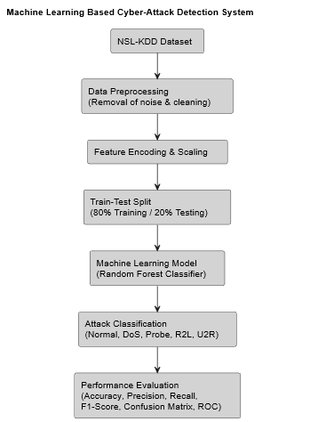
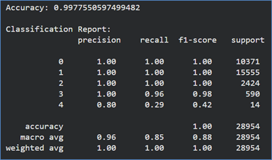
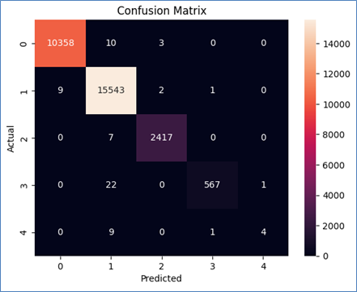
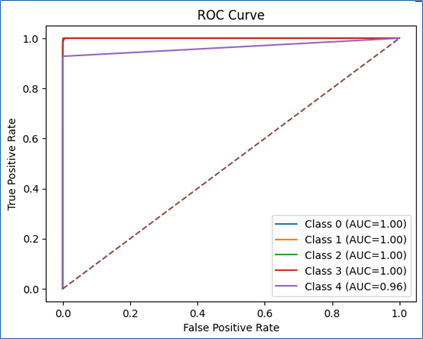

# Machine Learning Based Cyber-Attack Detection System 🛡️

## Problem Statement
Design a machine learning-based approach to identify Cyber Attacks.

## Introduction
Information security is a very important area in today’s digital world. Computer networks are constantly under threat from cyber attackers who try to steal data, damage systems, or interrupt services. Traditional security techniques are often not sufficient to detect new and complex attacks. 

This project develops an intelligent cyber-attack detection system using machine learning and the **NSL-KDD dataset**. It learns patterns from past network traffic to accurately classify new traffic as either normal or malicious.

## Objectives
* Understand the concept of cyber-attack detection.
* Use machine learning techniques for intrusion detection.
* Classify network traffic as normal or attack.
* Evaluate the performance of the machine learning model.

## Dataset Description
We utilized the **NSL-KDD dataset**, a refined version of the KDD Cup 1999 dataset widely used for intrusion detection research. 
* **Features:** 41 features (numeric and categorical).
* **Attack Categories:** Normal Traffic, Denial of Service (DoS), Probe Attacks, Remote to Local (R2L), and User to Root (U2R).

## Methodology
1. **Dataset Loading:** Loaded directly via Python from an online source.
2. **Data Preprocessing:** Removed unnecessary columns, handled missing values, and transformed categorical features.
3. **Feature Encoding & Scaling:** Applied Label Encoding and Standard Scaler normalization.
4. **Train-Test Split:** Split into 80% training and 20% testing sets.
5. **Model Training:** Trained a **Random Forest Classifier**.
6. **Model Testing & Evaluation:** Evaluated on unseen data using standard performance metrics.

## System Architecture



## Results and Evaluation
The Random Forest model achieved exceptionally high accuracy in detecting cyber attacks. Performance was measured using Accuracy, Precision, Recall, F1-Score, Confusion Matrix, and ROC Curve.

### Performance Visualizations

* **Accuracy:**
  


* **Confusion Matrix:**
  


* **ROC Curve:**
  


## Tools and Technologies Used
* **Language:** Python
* **Libraries:** Pandas, NumPy, Scikit-learn, Matplotlib, Seaborn
* **Environment:** Google Colab / Jupyter / PyCharm

## How to Run the Project
1. Clone this repository:
   ```bash
   git clone [https://github.com/CodeWith-AR/MachineLearning-Intrusion-Detection-System.git](https://github.com/CodeWith-AR/MachineLearning-Intrusion-Detection-System.git)
